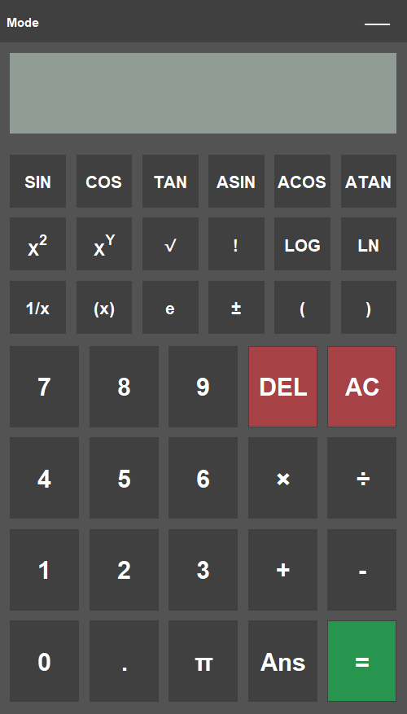

# Kasio

[](https://github.com/hethon/Kasio/actions)
[](https://github.com/pre-commit/pre-commit)
[](https://github.com/hethon/Kasio/releases)

Kasio is a Java Swing calculator app featuring a retro design inspired by classic scientific calculators.

<p align="center">
  
</p>

### The Backstory

This project started as a university group assignment back in 2024. I built the UI, a friend built the math parser, and after a frantic week, we slapped it together and submitted it. The final state of that old project can be seen [here](https://github.com/hethon/Kasio/tree/ce3384dd5f55cd2168947e603e0078f97d5eb574). It worked (mostly), but the code was messy and buggy.

Fast forward to 2026. I was on a completely different quest: trying to build an Android app *manually* from the command line, just to see if I could. After endless terminal commands, I ended up with a signed APK and a messy Python script called `build.py` to automate the steps. I had a vague sense of what build tools were for, but it was all still a black box.

Then I opened Android Studio for the first time and was hit by a wall named **Gradle**. It felt slow, magical, and I had no idea what it was doing. I realized the only way to understand this "magic" was to tame it myself on a project I already knew. That old, buggy calculator project was the perfect test subject.

### What I Learned & Implemented

This project became my sandbox for learning how professional software is built. Here's what I tackled:

*   **Architecture:** Refactored the original spaghetti code into a strict **Model-View-Controller (MVC)** architecture to separate the "brain" (the math) from the "face" (the UI).
*   **Build Tooling:** Migrated the entire project to **Gradle**, learning how to manage dependencies, package the app into a standalone "Fat JAR," and use the `--release` flag to ensure compatibility with older Java versions.
*   **Automation (CI/CD):** Built a full **CI/CD pipeline** with GitHub Actions that automatically runs tests, checks code formatting with **Spotless**, and publishes a new release every time I push a Git tag.
*   **Code Quality:** Integrated **pre-commit hooks** to auto-format code locally and wrote a comprehensive **JUnit** test suite to validate the calculator's logic and state management.
*   **Native Desktop UX:** Pushed Java Swing to its limits by integrating the app with the native OS **system tray**, making it a true background utility. I also solved cross-platform UI bugs by using logical fonts and rendering math symbols with Swing's built-in HTML support.

### How to Run

**Option 1: Download the App**

Head over to the [Releases tab](https://github.com/hethon/Kasio/releases) and download the latest standalone `.jar` file. You can double-click it to run it directly on any machine with Java installed.

**Option 2: Run from Source (Zero Setup Required)**

Thanks to the Gradle Wrapper and Toolchains, you don't need to install *anything* manually, not even Java!

The `gradlew` script included in the repository will automatically:
1. Download the correct version of Gradle.
2. Download the correct Java Development Kit (JDK) needed for the project.
3. Compile and run the application.

All you need is Git to clone the repository. Just run this in your terminal:

```bash
# 1. Clone the repository
git clone https://github.com/hethon/Kasio.git
cd Kasio

# 2. Run the app! (The first run might take a minute to download the JDK)
# Mac/Linux
./gradlew run

# Windows
gradlew run
```

### How to Contribute

Even though this project is mostly a personal learning playground, if you spot something I did wrong, know a better way to do it, or just want to add a cool feature, I am totally open to it!

Here is how to set up your local environment:

1. Fork the repository to your own GitHub account, then clone it to your machine:

```bash
git clone https://github.com/YOUR-USERNAME/Kasio.git
cd Kasio
```

2. Add my repository as the "upstream" so you can pull in future changes I make:

```bash
git remote add upstream https://github.com/hethon/Kasio.git
```

3. Make your changes on a new branch.

```bash
git checkout -b my-cool-new-feature
```

4. Install the "Bouncers" (Pre-commit hooks)

I fell in love with automating code quality, so I set up pre-commit to act as a bouncer for this repo. Before you can commit, it uses Spotless to auto-format the Java code (so we never have to argue about spaces vs tabs). Before you can push, it automatically runs the JUnit tests to make sure the math isn't broken.

Make sure you have [pre-commit installed](https://pre-commit.com/#install) (usually `pip install pre-commit`), then run:
```bash
# This installs both pre-commit hooks and pre-push hooks
pre-commit install
```
